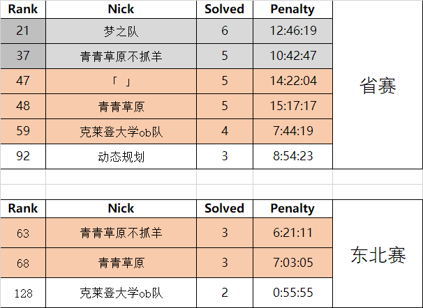
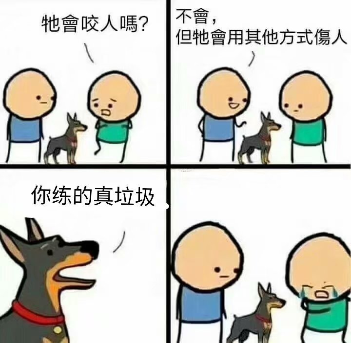

> - 水善利万物而不争, 处众人之所恶, 故几于道.
> - 夫唯不争, 是故天下莫能与之争.
    
> 本文不涉及自身算法水平丝毫, 仅于带队许久的一个交代.

- 很少有主动愿意做事的人了. 至少, 在目之所及的地方, 扫过的同学们之中, 没有达到我最初想要的标准的人. 至于现在这个情况, 是未曾设想过的.

- 不管有没有意外, 是不是愿意. 既然前辈们选择了我, 那我是不愿辜负这样一份信任的.  

- 最初挑起整个摊子的时候, 也是有一番打算的. 毕竟, 毕竟也是在以往接触过一批优秀的竞赛党. 也些许明白应该营造一种什么样的环境, 才是一个适于这样一批有活力, 有创造力, 有激情, 有梦想的人不断吸收知识, 不断强大自己的实验室.  

- 事实证明, 辛劳还是有那么一点点效果的. 寒假培训的时候根据经验主动联系有意愿的同学, 培训结束之后仍不断以朋友的身份督促其不要停止联系. 从四月份校赛的排名上来看, 应该说是有一定效果的.  

- 校赛之后就是省赛与东北赛. 以往来说, 东北赛和省赛对于HEU新生的目的是踏入这个赛场, 体验一把比赛的感觉. 从来没有人想过, 我校的新生队可以在这两个比赛之中, 省赛只有一个队伍没有获奖. 甚至, 省赛有两个银牌, 东北赛有两个铜牌. 换言之, 当下校队里, 都是第一次参加算法竞赛就取得奖项的同学. 我没有统计过, 但是, 也常常私下里说, 这是历年以来省赛与东北赛成绩最好的一届新生了.  

- 可是慢慢的味道开始变了. 各种各样神奇的事情如潮水一般涌来. 可是在应付院系或社会机构的琐事之外, 还需要面对决策的分歧. 尽管时隔许久之后也是会说"我又仔细想了一下你说的事情, 觉得还是你说的对". 可是并不是每一次都有时间去验证究竟是谁的决策更优. 恰巧, 我也不是很喜欢争吵, 更不喜欢去将一些感觉上的事情去描述出来. 那么, 争吵与分歧也在于情理之中了.  

- 真的不巧, 我讨厌争吵. 所以后期但凡分歧, 皆以沉默告终.  

- 恰巧不巧呢, 保持沉默之后事情出人意料的少了起来, 或者说, 事情再也没有经过我手. 也好, 福祸无关. 恰巧落得一身悠闲.  

- 总体来看也算兢兢业业, 未曾想过一丝饱中私囊. 辛苦不说, 修修补补也做了不少. 但凡有利可图的事情也都分享给了诸君. 而当下不知为什么是替谁背了什么锅. 不过不重要了. 不管怎样, 我在的时候还是尽力把事情挡在外面, 不让任何人欺负的. 希望今后这个地方也能如此吧. 如今借着事由溜了, 好运.  
